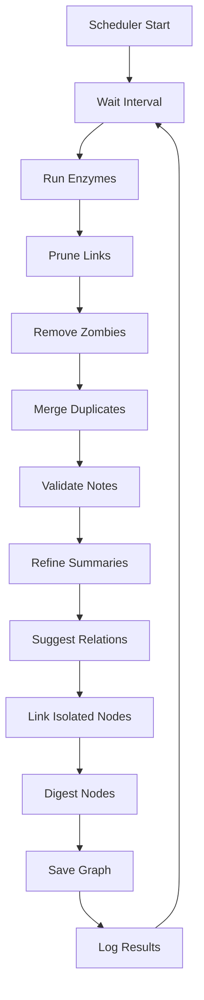
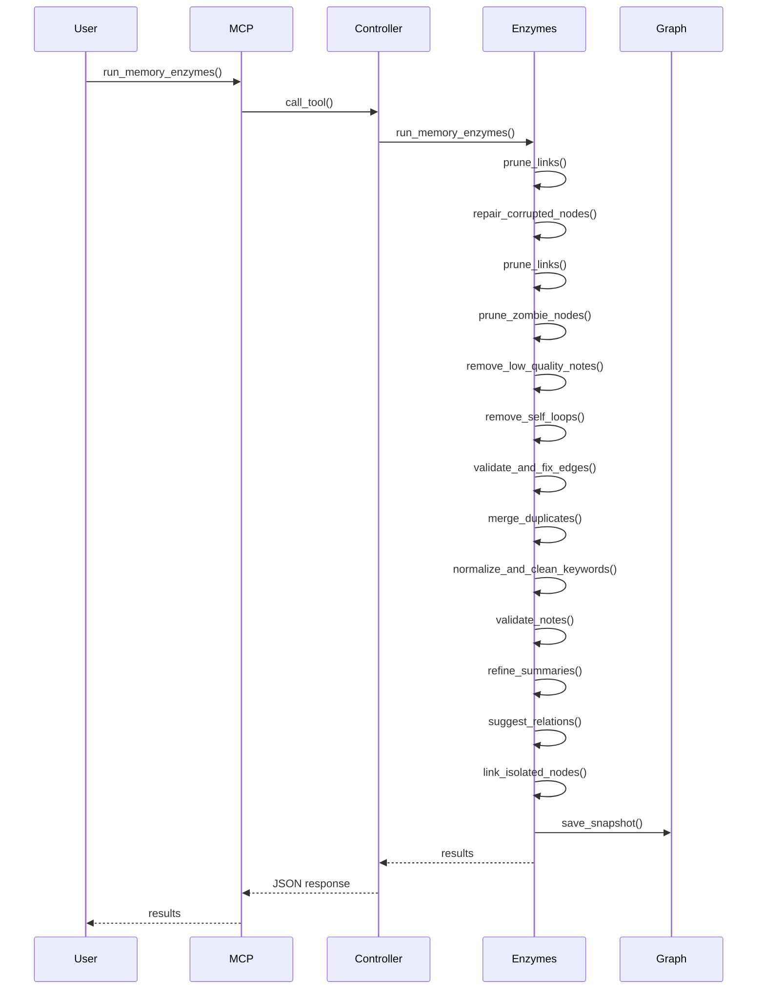
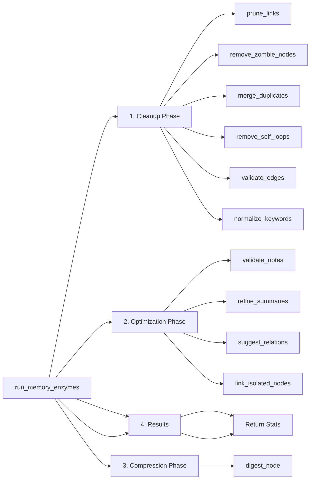

# Memory Enzymes - Ausführliche Dokumentation

## 📋 Inhaltsverzeichnis

1. [Übersicht](#übersicht)
2. [Architektur](#architektur)
3. [Code-Einbindung](#code-einbindung)
4. [Enzyme-Funktionen](#enzyme-funktionen)
5. [Workflow](#workflow)
6. [Konfiguration](#konfiguration)
7. [Beispiele](#beispiele)
8. [Troubleshooting](#troubleshooting)

---

## Übersicht

**Memory Enzymes** sind autonome Hintergrund-Prozesse, die den Knowledge Graph automatisch optimieren und pflegen. Sie implementieren das KISS-Prinzip (Keep It Simple, Stupid) mit kleinen, unabhängigen Modulen.

### Hauptmerkmale

**14+ Maintenance Operations:**

- ✅ **Automatischer Scheduler**: Läuft stündlich im Hintergrund
- ✅ **Corrupted Node Repairer**: Repariert korrupte Nodes (z.B. 'None' Strings)
- ✅ **Link Pruner**: Entfernt alte/schwache Links und Zombie Nodes
- ✅ **Zombie Node Remover**: Entfernt Nodes ohne Content
- ✅ **Low Quality Note Remover**: Entfernt irrelevante Notes (CAPTCHA, Fehlerseiten)
- ✅ **Self-Loop Remover**: Entfernt Self-Referencing Edges
- ✅ **Edge Validator**: Validiert und korrigiert Edges (Reasoning, Types, schwache Edges)
- ✅ **Duplicate Merger**: Findet und merged Duplikate (exakt und semantisch)
- ✅ **Keyword Normalizer**: Normalisiert und bereinigt Keywords
- ✅ **Note Validator**: Validiert und korrigiert Notes (Content, Summary, Keywords, Tags)
- ✅ **Quality Score Calculator**: Berechnet Quality-Scores für Notes
- ✅ **Summary Refiner**: Macht ähnliche Summarys spezifischer
- ✅ **Relation Suggester**: Findet neue semantische Verbindungen
- ✅ **Isolated Node Linker**: Verlinkt isolierte Nodes automatisch
- ✅ **Summary Digester**: Komprimiert überfüllte Nodes

---

## Architektur

### Komponenten

```
┌─────────────────────────────────────────────────────────────┐
│                  Memory Enzymes System                       │
├─────────────────────────────────────────────────────────────┤
│                                                               │
│  ┌──────────────┐  ┌──────────────┐  ┌──────────────┐    │
│  │ Link Pruner  │  │ Relation     │  │ Summary      │    │
│  │              │  │ Suggester    │  │ Digester     │    │
│  └──────────────┘  └──────────────┘  └──────────────┘    │
│         │                  │                  │             │
│  ┌──────────────┐  ┌──────────────┐  ┌──────────────┐    │
│  │ Note         │  │ Duplicate    │  │ Isolated    │    │
│  │ Validator     │  │ Merger      │  │ Node Linker │    │
│  └──────────────┘  └──────────────┘  └──────────────┘    │
│                                                               │
│  ┌──────────────┐  ┌──────────────┐  ┌──────────────┐    │
│  │ Edge          │  │ Keyword      │  │ Quality     │    │
│  │ Validator     │  │ Normalizer   │  │ Calculator  │    │
│  └──────────────┘  └──────────────┘  └──────────────┘    │
│                                                               │
│  ┌──────────────┐  ┌──────────────┐  ┌──────────────┐    │
│  │ Corrupted     │  │ Low Quality  │  │ Self-Loop   │    │
│  │ Node Repairer │  │ Note Remover │  │ Remover      │    │
│  └──────────────┘  └──────────────┘  └──────────────┘    │
│                                                               │
│  ┌──────────────────────────────────────────────────────┐  │
│  │         Enzyme Scheduler (Automatic Runner)           │  │
│  └──────────────────────────────────────────────────────┘  │
│                                                               │
└─────────────────────────────────────────────────────────────┘
```

### Dateistruktur

```
src/a_mem/utils/
└── enzymes.py          # Alle Enzyme-Funktionen + run_memory_enzymes()
```

---

## Code-Einbindung

### 1. Automatischer Scheduler

**Datei:** `src/a_mem/core/logic.py`

**Initialisierung:**

```python
class MemoryController:
    def __init__(self):
        self.storage = StorageManager()
        self.llm = LLMService()
        self._enzyme_scheduler_task = None
        self._auto_save_task = None
        self._enzyme_scheduler_running = False
        self._auto_save_interval = 5.0  # Default: 5 minutes
```

**Scheduler starten:**

```python
def start_enzyme_scheduler(self, interval_hours: float = 1.0, auto_save_interval_minutes: float = 5.0):
    """
    Startet den automatischen Enzyme-Scheduler.
    
    Args:
        interval_hours: Intervall in Stunden (default: 1.0 = 1 Stunde)
        auto_save_interval_minutes: Intervall in Minuten für automatisches Speichern (default: 5.0)
    """
    if self._enzyme_scheduler_running:
        log_debug("[WARNING] Enzyme-Scheduler läuft bereits")
        return
    
    self._enzyme_scheduler_running = True
    self._auto_save_interval = auto_save_interval_minutes
    self._enzyme_scheduler_task = asyncio.create_task(
        self._enzyme_scheduler_loop(interval_hours)
    )
    # Start auto-save task
    self._auto_save_task = asyncio.create_task(
        self._auto_save_loop(auto_save_interval_minutes)
    )
    log_debug(f"[OK] Enzyme-Scheduler gestartet (Intervall: {interval_hours}h, Auto-Save: {auto_save_interval_minutes}min)")
    log_event("ENZYME_SCHEDULER_STARTED", {
        "interval_hours": interval_hours,
        "auto_save_interval_minutes": auto_save_interval_minutes
    })
```

**Scheduler-Loop:**

```python
async def _enzyme_scheduler_loop(self, interval_hours: float):
    """
    Background-Loop für automatische Enzyme-Ausführung.
    
    Args:
        interval_hours: Intervall in Stunden
    """
    interval_seconds = interval_hours * 3600
    
    while self._enzyme_scheduler_running:
        try:
            # Warte auf Intervall
            await asyncio.sleep(interval_seconds)
            
            # Führe Enzyme aus
            log_debug(f"[SCHEDULER] Führe Memory-Enzyme aus...")
            loop = asyncio.get_running_loop()
            
            def _run_enzymes():
                return run_memory_enzymes(
                    self.storage.graph,
                    self.llm,
                    prune_config={
                        "max_age_days": 90,
                        "min_weight": 0.3
                    },
                    suggest_config={
                        "threshold": 0.75,
                        "max_suggestions": 10
                    }
                )
            
            results = await loop.run_in_executor(None, _run_enzymes)
            
            # Graph speichern
            await loop.run_in_executor(None, self.storage.graph.save_snapshot)
            
            zombie_count = results.get('zombie_nodes_removed', 0)
            log_debug(f"[OK] [Scheduler] Enzyme abgeschlossen: {results['pruned_count']} links pruned, {zombie_count} zombie nodes removed, {results['suggestions_count']} suggested, {results['digested_count']} digested")
            
            log_event("ENZYME_SCHEDULER_RUN", {
                "results": results,
                "interval_hours": interval_hours
            })
            
        except asyncio.CancelledError:
            log_debug("[STOP] [Scheduler] Wurde gestoppt")
            break
        except Exception as e:
            log_debug(f"[ERROR] [Scheduler] Fehler bei Enzyme-Ausführung: {e}")
            log_event("ENZYME_SCHEDULER_ERROR", {
                "error": str(e)
            })
            # Warte kurz bevor Retry (um nicht in Endlosschleife zu kommen)
            await asyncio.sleep(60)  # 1 Minute
```

**Auto-Save-Loop:**

```python
async def _auto_save_loop(self, interval_minutes: float):
    """
    Background-Loop für automatisches Speichern des Graphs.
    
    Args:
        interval_minutes: Intervall in Minuten
    """
    interval_seconds = interval_minutes * 60
    
    while self._enzyme_scheduler_running:
        try:
            # Warte auf Intervall
            await asyncio.sleep(interval_seconds)
            
            # Speichere Graph
            loop = asyncio.get_running_loop()
            await loop.run_in_executor(None, self.storage.graph.save_snapshot)
            log_debug(f"[SAVE] [Auto-Save] Graph saved to disk")
            log_event("AUTO_SAVE", {"interval_minutes": interval_minutes})
            
        except asyncio.CancelledError:
            log_debug("[STOP] [Auto-Save] Wurde gestoppt")
            break
        except Exception as e:
            log_debug(f"[ERROR] [Auto-Save] Fehler beim Speichern: {e}")
            log_event("AUTO_SAVE_ERROR", {"error": str(e)})
            # Warte kurz bevor Retry
            await asyncio.sleep(60)  # 1 Minute
```

### 2. Manuelle Nutzung via MCP Tool

**Datei:** `src/a_mem/main.py`

**Tool-Definition:**

```python
Tool(
    name="run_memory_enzymes",
    description="Runs memory maintenance: prunes old/weak links and zombie nodes, suggests new relations, digests overcrowded nodes. Automatically optimizes graph structure.",
    inputSchema={
        "type": "object",
        "properties": {
            "prune_max_age_days": {
                "type": "integer",
                "description": "Maximum age in days for edges to be pruned (default: 90).",
                "default": 90
            },
            "prune_min_weight": {
                "type": "number",
                "description": "Minimum weight for edges to be kept (default: 0.3).",
                "default": 0.3
            },
            "suggest_threshold": {
                "type": "number",
                "description": "Minimum similarity threshold for relation suggestions (default: 0.75).",
                "default": 0.75
            },
            "suggest_max": {
                "type": "integer",
                "description": "Maximum number of relation suggestions (default: 10).",
                "default": 10
            },
            "refine_similarity_threshold": {
                "type": "number",
                "description": "Minimum similarity threshold for summary refinement (default: 0.75).",
                "default": 0.75
            },
            "refine_max": {
                "type": "integer",
                "description": "Maximum number of summaries to refine per run (default: 10).",
                "default": 10
            },
            "auto_add_suggestions": {
                "type": "boolean",
                "description": "If true, automatically adds suggested relations to the graph instead of just suggesting them (default: false).",
                "default": false
            },
            "ignore_flags": {
                "type": "boolean",
                "description": "If true, ignores validation flags and forces re-validation of all notes (default: false).",
                "default": false
            }
        }
    }
)
```

**Tool-Implementierung:**

```python
elif name == "run_memory_enzymes":
    prune_max_age_days = arguments.get("prune_max_age_days", 90)
    prune_min_weight = arguments.get("prune_min_weight", 0.3)
    suggest_threshold = arguments.get("suggest_threshold", 0.75)
    suggest_max = arguments.get("suggest_max", 10)
    refine_similarity_threshold = arguments.get("refine_similarity_threshold", 0.75)
    refine_max = arguments.get("refine_max", 10)
    auto_add_suggestions = arguments.get("auto_add_suggestions", False)
    ignore_flags = arguments.get("ignore_flags", False)
    
    try:
        from .utils.enzymes import run_memory_enzymes
        
        results = run_memory_enzymes(
            controller.storage.graph,
            controller.llm,
            prune_config={
                "max_age_days": prune_max_age_days,
                "min_weight": prune_min_weight
            },
            suggest_config={
                "threshold": suggest_threshold,
                "max_suggestions": suggest_max
            },
            refine_config={
                "similarity_threshold": refine_similarity_threshold,
                "max_refinements": refine_max
            },
            auto_add_suggestions=auto_add_suggestions,
            ignore_flags=ignore_flags
        )
        
        return [TextContent(
            type="text",
            text=json.dumps({
                "status": "success",
                "message": f"Enzymes completed: {results['pruned_count']} links pruned, {results['zombie_nodes_removed']} zombie nodes removed, {results['suggestions_count']} suggested, {results['digested_count']} digested.",
                **results
            }, indent=2)
        )]
    except Exception as e:
        return [TextContent(
            type="text",
            text=json.dumps({
                "status": "error",
                "message": f"Enzyme execution failed: {str(e)}"
            }, indent=2)
        )]
```

---

## Enzyme-Funktionen

### 0. Corrupted Node Repairer (`repair_corrupted_nodes`)

**Zweck:** Repariert korrupte Nodes (z.B. `created_at = 'None'` String statt datetime, `keywords = 'None'` statt Liste).

**Parameter:**
- `graph` (GraphStore): Graph-Instanz

**Rückgabe:** Anzahl reparierte Nodes

**Reparaturen:**
- `created_at` als String 'None' oder leer → Setze auf aktuelles Datum
- `keywords` als String 'None' oder ungültiges JSON → Setze auf leere Liste
- `tags` als String 'None' oder ungültiges JSON → Setze auf leere Liste
- Andere korrupte Felder werden ebenfalls repariert

**Code:** Siehe `src/a_mem/utils/enzymes.py` Zeilen 2212-2310

**Hinweis:** Wird als **erstes** ausgeführt, bevor alle anderen Enzyme-Operationen.

---

### 1. Link Pruner (`prune_links`)

**Zweck:** Entfernt alte/schwache Links und Zombie Nodes.

**Parameter:**
- `graph` (GraphStore): Graph-Instanz
- `max_age_days` (int): Max. Alter in Tagen (default: 90)
- `min_weight` (float): Minimale Edge-Weight (default: 0.3)
- `min_usage` (int): Minimale Usage-Count (default: 0)

**Rückgabe:** Anzahl entfernte Edges

**Kriterien für Entfernung:**
1. Edge älter als `max_age_days`
2. Edge-Weight < `min_weight`
3. Edge zu nicht existierender Node (Orphaned Edge)
4. Edge zu Node ohne Content (Zombie Node)

**Code:**
```python
def prune_links(
    graph: GraphStore,
    max_age_days: int = 90,
    min_weight: float = 0.3,
    min_usage: int = 0
) -> int:
    """
    Entfernt schwache oder alte Kanten aus dem Graph.
    """
    now = datetime.utcnow()
    to_remove = []
    
    for source, target, data in graph.graph.edges(data=True):
        should_remove = False
        
        # CRITICAL: Orphaned Edge Check
        if source not in graph.graph.nodes or target not in graph.graph.nodes:
            to_remove.append((source, target))
            continue
        
        # CRITICAL: Zombie Node Check
        source_node = graph.graph.nodes[source]
        target_node = graph.graph.nodes[target]
        
        source_has_content = source_node.get("content", "").strip() if "content" in source_node else ""
        target_has_content = target_node.get("content", "").strip() if "content" in target_node else ""
        
        if not source_has_content or not target_has_content:
            to_remove.append((source, target))
            continue
        
        # Age Check
        edge_created = data.get("created_at")
        if edge_created:
            try:
                created_date = datetime.fromisoformat(edge_created.replace('Z', '+00:00'))
                age_days = (now - created_date.replace(tzinfo=None)).days
                if age_days > max_age_days:
                    should_remove = True
            except Exception:
                pass
        
        # Weight Check
        weight = data.get("weight", 1.0)
        if weight < min_weight:
            should_remove = True
        
        if should_remove:
            to_remove.append((source, target))
    
    # Remove edges
    for source, target in to_remove:
        if graph.graph.has_edge(source, target):
            graph.graph.remove_edge(source, target)
    
    return len(to_remove)
```

### 1.5. Low Quality Note Remover (`remove_low_quality_notes`)

**Zweck:** Entfernt Notes mit irrelevantem oder fehlerhaftem Content.

**Parameter:**
- `notes` (Dict[str, AtomicNote]): Dict aller Notes
- `graph` (GraphStore): Graph-Instanz
- `llm_service` (Optional[LLMService]): Optional LLM Service für Content-Validierung

**Rückgabe:** Anzahl entfernte Notes

**Erkannte Patterns:**
- CAPTCHA-Content
- Fehlerseiten/Redirect-Seiten (403, 404, blocked, denied)
- Leere/ungültige Content (< 50 Zeichen)
- Irrelevante Content-Patterns (cookie consent, privacy policy, etc.)
- Researcher-Agent Notes mit problematischem Content

**Code:** Siehe `src/a_mem/utils/enzymes.py` Zeilen 1798-1913

---

### 1.6. Self-Loop Remover (`remove_self_loops`)

**Zweck:** Entfernt Self-Loops (Edges von einem Node zu sich selbst).

**Parameter:**
- `graph` (GraphStore): Graph-Instanz

**Rückgabe:** Anzahl entfernte Self-Loops

**Code:**
```python
def remove_self_loops(graph: GraphStore) -> int:
    """
    Entfernt Self-Loops (Edges von einem Node zu sich selbst).
    """
    self_loops = []
    
    for node_id in graph.graph.nodes():
        if graph.graph.has_edge(node_id, node_id):
            self_loops.append(node_id)
            graph.graph.remove_edge(node_id, node_id)
    
    return len(self_loops)
```

---

### 1.7. Edge Validator (`validate_and_fix_edges`)

**Zweck:** Validiert und korrigiert Edges (Reasoning, Types, entfernt schwache Edges).

**Parameter:**
- `graph` (GraphStore): Graph-Instanz
- `notes` (Dict[str, AtomicNote]): Dict aller Notes
- `llm_service` (Optional[LLMService]): Optional LLM Service für Reasoning-Generierung
- `min_weight_for_reasoning` (float): Minimale Weight für Edges die Reasoning benötigen (default: 0.65)
- `ignore_flags` (bool): Ignoriere Flags (default: False)

**Rückgabe:** Dict mit Ergebnissen:
- `edges_removed`: Anzahl entfernte Edges
- `reasonings_added`: Anzahl ergänzte Reasoning-Felder
- `types_standardized`: Anzahl standardisierte Relation Types

**Validierungen:**
1. **Standardisiert Relation Types**: `similar_to` → `relates_to`
2. **Prüft Reasoning-Feld**: 
   - Edges mit hohem Weight aber negativem Reasoning → entfernen
   - Edges mit Weight aber ohne Reasoning → Reasoning generieren oder entfernen
3. **Entfernt widersprüchliche Edges**: Reasoning sagt "keine Beziehung" aber Weight ist hoch
4. **Entfernt schwache Edges**: Weight < threshold und kein Reasoning

**Code:** Siehe `src/a_mem/utils/enzymes.py` Zeilen 592-773

---

### 2. Zombie Node Remover (`prune_zombie_nodes`)

**Zweck:** Entfernt Nodes ohne Content (gelöschte/leere Nodes).

**Parameter:**
- `graph` (GraphStore): Graph-Instanz

**Rückgabe:** Anzahl entfernte Nodes

**Code:**
```python
def remove_zombie_nodes(graph: GraphStore) -> int:
    """
    Entfernt Zombie Nodes (Nodes ohne Content).
    """
    to_remove = []
    
    for node_id in graph.graph.nodes():
        node_data = graph.graph.nodes[node_id]
        
        # Prüfe ob Node leer ist oder kein Content hat
        if len(node_data) == 0 or "content" not in node_data:
            to_remove.append(node_id)
            continue
        
        content = node_data.get("content", "")
        if not content or len(str(content).strip()) == 0:
            to_remove.append(node_id)
    
    # Remove nodes
    for node_id in to_remove:
        if node_id in graph.graph.nodes:
            graph.graph.remove_node(node_id)
    
    return len(to_remove)
```

### 3. Duplicate Merger (`merge_duplicates`)

**Zweck:** Findet und merged Duplikate (Notes mit identischem Content).

**Parameter:**
- `notes` (Dict[str, AtomicNote]): Dict aller Notes
- `graph` (GraphStore): Graph-Instanz
- `content_similarity_threshold` (float): Similarity-Threshold (default: 0.98)

**Rückgabe:** Anzahl gemergte Duplikate

**Strategie:**
1. Finde Notes mit identischem Content
2. Behalte beste Note (mehr Metadaten, bessere Summary, mehr Verbindungen)
3. Leite alle Edges von Duplikaten auf behaltene Note um
4. Lösche Duplikate

**Code:**
```python
def merge_duplicates(
    notes: Dict[str, AtomicNote],
    graph: GraphStore,
    content_similarity_threshold: float = 0.98
) -> int:
    """
    Findet und merged Duplikate (Notes mit identischem oder sehr ähnlichem Content).
    """
    merged_count = 0
    note_ids = list(notes.keys())
    to_remove = set()
    
    # Finde Duplikate (identischer Content)
    for i in range(len(note_ids)):
        if note_ids[i] in to_remove:
            continue
            
        for j in range(i + 1, len(note_ids)):
            if note_ids[j] in to_remove:
                continue
            
            note_a = notes[note_ids[i]]
            note_b = notes[note_ids[j]]
            
            # Exakte Content-Übereinstimmung
            if note_a.content.strip() == note_b.content.strip() and note_a.content.strip():
                # Entscheide welche Note behalten wird
                keep_id, remove_id = _choose_best_note(
                    note_ids[i], note_ids[j], note_a, note_b, graph
                )
                
                if keep_id and remove_id:
                    # Leite Edges um
                    _redirect_edges(graph, remove_id, keep_id)
                    
                    # Markiere zum Löschen
                    to_remove.add(remove_id)
                    merged_count += 1
    
    # Entferne Duplikate
    for node_id in to_remove:
        if node_id in graph.graph.nodes:
            graph.graph.remove_node(node_id)
    
    return merged_count
```

### 4. Relation Suggester (`suggest_relations`)

**Zweck:** Schlägt neue Beziehungen zwischen Notes vor basierend auf semantischer Ähnlichkeit.

**Parameter:**
- `notes` (Dict[str, AtomicNote]): Dict aller Notes
- `graph` (GraphStore): Graph-Instanz
- `llm_service` (LLMService): LLM Service für Embeddings
- `threshold` (float): Minimale Similarity (default: 0.75)
- `max_suggestions` (int): Max. Anzahl Vorschläge (default: 10)

**Rückgabe:** Liste von `(source_id, target_id, similarity)` Tupeln

**Code:**
```python
def suggest_relations(
    notes: Dict[str, AtomicNote],
    graph: GraphStore,
    llm_service: LLMService,
    threshold: float = 0.75,
    max_suggestions: int = 10
) -> List[Tuple[str, str, float]]:
    """
    Schlägt neue Beziehungen zwischen Notes vor basierend auf semantischer Ähnlichkeit.
    """
    if len(notes) < 2:
        return []
    
    suggestions = []
    note_ids = list(notes.keys())
    
    # Embeddings einmal berechnen
    vectors = {}
    for note_id, note in notes.items():
        text = f"{note.content} {note.contextual_summary} {' '.join(note.keywords)}"
        embedding = llm_service.get_embedding(text)
        vectors[note_id] = embedding
    
    # Paarweiser Vergleich (nur wenn nicht bereits verbunden)
    for i in range(len(note_ids)):
        for j in range(i + 1, len(note_ids)):
            if len(suggestions) >= max_suggestions:
                break
            
            a_id, b_id = note_ids[i], note_ids[j]
            
            # Prüfe ob bereits verbunden
            if graph.graph.has_edge(a_id, b_id) or graph.graph.has_edge(b_id, a_id):
                continue
            
            # Pre-Filter: Wenn keine gemeinsamen Keywords/Tags → Skip
            common_keywords = set(notes[a_id].keywords) & set(notes[b_id].keywords)
            common_tags = set(notes[a_id].tags) & set(notes[b_id].tags)
            
            if not common_keywords and not common_tags:
                continue
            
            # Cosine Similarity berechnen
            similarity = cosine_similarity(vectors[a_id], vectors[b_id])
            
            if similarity >= threshold:
                suggestions.append((a_id, b_id, similarity))
    
    # Sortiere nach Similarity (höchste zuerst)
    suggestions.sort(key=lambda x: x[2], reverse=True)
    
    return suggestions[:max_suggestions]
```

### 5. Summary Digester (`digest_node`)

**Zweck:** Komprimiert überfüllte Nodes (viele Children) in kompakte Zusammenfassungen.

**Parameter:**
- `node_id` (str): ID des überfüllten Nodes
- `child_notes` (List[AtomicNote]): Liste der Child-Notes
- `llm_service` (LLMService): LLM Service für Zusammenfassung
- `max_children` (int): Max. Anzahl Children (default: 8)

**Rückgabe:** Zusammenfassungstext oder None

**Code:**
```python
def digest_node(
    node_id: str,
    child_notes: List[AtomicNote],
    llm_service: LLMService,
    max_children: int = 8
) -> Optional[str]:
    """
    Wenn ein Node zu viele Kinder hat, erzeugt eine kompakte Zusammenfassung.
    """
    if len(child_notes) <= max_children:
        return None
    
    # Sammle Content aller Children
    texts = "\n\n---\n\n".join([
        f"[{note.id}] {note.content}\nSummary: {note.contextual_summary}\nKeywords: {', '.join(note.keywords)}"
        for note in child_notes
    ])
    
    prompt = f"""Fasse folgende {len(child_notes)} Notizen prägnant zusammen.
Ziel: Eine abstrahierte, verdichtete Meta-Note die die Essenz aller Notizen erfasst.

Notizen:
{texts}

Erstelle eine kompakte Zusammenfassung (max 200 Wörter) die:
1. Die Hauptthemen zusammenfasst
2. Gemeinsame Patterns identifiziert
3. Wichtige Details bewahrt
4. Redundanzen eliminiert

Zusammenfassung:"""
    
    try:
        summary = llm_service._call_llm(prompt)
        return summary
    except Exception as e:
        log_debug(f"Digest Error für Node {node_id}: {e}")
        return None
```

### 5.5. Keyword Normalizer (`normalize_and_clean_keywords`)

**Zweck:** Normalisiert und bereinigt Keywords.

**Parameter:**
- `notes` (Dict[str, AtomicNote]): Dict aller Notes
- `graph` (GraphStore): Graph-Instanz
- `llm_service` (Optional[LLMService]): Optional LLM Service für Keyword-Korrektur
- `max_keywords` (int): Maximale Anzahl Keywords pro Note (default: 7)
- `ignore_flags` (bool): Ignoriere Flags (default: False)

**Rückgabe:** Dict mit Ergebnissen:
- `keywords_normalized`: Anzahl normalisierte Keywords
- `keywords_removed`: Anzahl entfernte Keywords
- `keywords_corrected`: Anzahl korrigierte Keywords

**Normalisierungen:**
1. **Normalisiert Groß-/Kleinschreibung**: 
   - Akronyme (MCP, API, IDE) → UPPERCASE
   - Programmiersprachen (Python, JavaScript) → Capitalize
   - Mehrwort-Keywords → Title Case
2. **Entfernt generische Keywords**: "befehl", "skript", "tool", "reference", etc.
3. **Korrigiert falsche Keyword-Zuordnungen**: Via LLM wenn Keywords nicht zum Content passen
4. **Reduziert auf max_keywords**: Behält die wichtigsten/spezifischsten
5. **Entfernt Duplikate**: Case-insensitive

**Code:** Siehe `src/a_mem/utils/enzymes.py` Zeilen 978-1141

---

### 5.6. Quality Score Calculator (`calculate_quality_score`)

**Zweck:** Berechnet einen Quality-Score für eine Note (0.0 - 1.0).

**Parameter:**
- `note` (AtomicNote): Note
- `graph` (GraphStore): Graph-Instanz
- `node_id` (str): ID der Note

**Rückgabe:** Dict mit:
- `score`: Gesamt-Score (0.0 - 1.0)
- `content_score`: Content-Qualität (0.0 - 1.0)
- `summary_score`: Summary-Qualität (0.0 - 1.0)
- `keywords_score`: Keywords-Qualität (0.0 - 1.0)
- `tags_score`: Tags-Qualität (0.0 - 1.0)
- `linking_score`: Verlinkungsgrad (0.0 - 1.0)
- `metadata_score`: Metadata-Vollständigkeit (0.0 - 1.0)
- `issues`: Liste von Quality-Issues

**Bewertungskriterien:**
- **Content-Score** (25%): Länge, Vollständigkeit
- **Summary-Score** (20%): Länge, Spezifität
- **Keywords-Score** (15%): Anzahl (2-7 optimal), Relevanz
- **Tags-Score** (10%): Anzahl (1-5 optimal)
- **Linking-Score** (15%): Anzahl Connections
- **Metadata-Score** (15%): Vollständigkeit

**Code:** Siehe `src/a_mem/utils/enzymes.py` Zeilen 1143-1242

---

### 6. Note Validator (`validate_notes`)

**Zweck:** Validiert Notes und korrigiert fehlende/ungültige Felder.

**Parameter:**
- `notes` (Dict[str, AtomicNote]): Dict aller Notes
- `graph` (GraphStore): Graph-Instanz
- `llm_service` (Optional[LLMService]): Optional LLM Service für Korrekturen
- `max_flag_age_days` (int): Max. Alter der Flags (default: 30)
- `ignore_flags` (bool): Ignoriere Flags (default: False)

**Rückgabe:** Dict mit Validierungs-Ergebnissen

**Prüfungen:**
- Content vorhanden und nicht leer
- Summary vorhanden, sinnvoll und passend
- Keywords vorhanden (mindestens 2) und passend
- Tags vorhanden (mindestens 1) und passend
- Type korrekt gesetzt
- Metadata vollständig

**Code:** Siehe `src/a_mem/utils/enzymes.py` Zeilen 1112-1572

### 7. Summary Refiner (`refine_summaries`)

**Zweck:** Macht ähnliche Summarys spezifischer (verhindert Duplikate).

**Parameter:**
- `notes` (Dict[str, AtomicNote]): Dict aller Notes
- `graph` (GraphStore): Graph-Instanz
- `llm_service` (LLMService): LLM Service für Refinement
- `similarity_threshold` (float): Similarity-Threshold (default: 0.75)
- `max_refinements` (int): Max. Anzahl Refinements (default: 10)

**Rückgabe:** Anzahl verfeinerte Summarys

**Strategie:**
1. Findet Notes mit ähnlichen/identischen Summarys (via Embedding-Similarity)
2. Prüft ob Content unterschiedlich ist (sonst macht Refinement keinen Sinn)
3. Erstellt spezifischere Summarys via LLM für jede Note
4. Speichert verfeinerte Summarys im Graph

**Code:** Siehe `src/a_mem/utils/enzymes.py` Zeilen 1916-2070

### 8. Isolated Node Linker (`link_isolated_nodes`)

**Zweck:** Verlinkt isolierte Nodes automatisch mit ähnlichen Notes.

**Parameter:**
- `isolated_node_ids` (List[str]): Liste isolierter Node-IDs
- `all_notes` (Dict[str, AtomicNote]): Dict aller Notes
- `graph` (GraphStore): Graph-Instanz
- `llm_service` (LLMService): LLM Service für Embeddings
- `similarity_threshold` (float): Similarity-Threshold (default: 0.70)
- `max_links_per_node` (int): Max. Links pro Node (default: 3)

**Rückgabe:** Anzahl erstellter Links

**Code:** Siehe `src/a_mem/utils/enzymes.py` Zeilen 614-700

### 9. Hauptfunktion (`run_memory_enzymes`)

**Zweck:** Führt alle Enzyme aus in optimierter Reihenfolge.

**Ausführungsreihenfolge:**
1. **Repair Phase**: `repair_corrupted_nodes()` - Repariert korrupte Nodes
2. **Cleanup Phase**: 
   - `prune_links()` - Entfernt alte/schwache Links
   - `prune_zombie_nodes()` - Entfernt Zombie Nodes
   - `remove_low_quality_notes()` - Entfernt irrelevante Notes
   - `remove_self_loops()` - Entfernt Self-Loops
   - `validate_and_fix_edges()` - Validiert und korrigiert Edges
   - `merge_duplicates()` - Merged Duplikate
   - `normalize_and_clean_keywords()` - Normalisiert Keywords
3. **Optimization Phase**:
   - `validate_notes()` - Validiert Notes
   - `refine_summaries()` - Verfeinert Summarys
   - `suggest_relations()` - Schlägt neue Relations vor
   - `link_isolated_nodes()` - Verlinkt isolierte Nodes
4. **Compression Phase**:
   - `digest_node()` - Komprimiert überfüllte Nodes

**Parameter:** Siehe MCP Tool Definition (Zeilen 216-265)

**Rückgabe:** Dict mit detaillierten Ergebnissen aller Operations

**Zweck:** Führt alle Enzyme aus.

**Parameter:**
- `graph` (GraphStore): Graph-Instanz
- `llm_service` (LLMService): LLM Service
- `prune_config` (Optional[Dict]): Prune-Konfiguration
- `suggest_config` (Optional[Dict]): Suggest-Konfiguration
- `refine_config` (Optional[Dict]): Refine-Konfiguration
- `auto_add_suggestions` (bool): Auto-Add Suggestions (default: False)
- `ignore_flags` (bool): Ignoriere Flags (default: False)

**Rückgabe:** Dict mit Ergebnissen

**Code:** Siehe `src/a_mem/utils/enzymes.py` Zeilen 1989-2322

---

## Workflow

### Automatischer Workflow (Scheduler)



### Manueller Workflow (MCP Tool)



### Detaillierter Enzyme-Workflow



---

## Konfiguration

### Standard-Konfiguration

**Automatischer Scheduler:**
- Intervall: 1 Stunde
- Auto-Save: 5 Minuten

**Enzyme-Parameter:**
- `prune_max_age_days`: 90
- `prune_min_weight`: 0.3
- `suggest_threshold`: 0.75
- `suggest_max`: 10
- `refine_similarity_threshold`: 0.75
- `refine_max`: 10
- `auto_add_suggestions`: false
- `ignore_flags`: false

### Anpassung

**Via Code:**
```python
# Scheduler starten mit custom Intervall
controller.start_enzyme_scheduler(
    interval_hours=2.0,  # Alle 2 Stunden
    auto_save_interval_minutes=10.0  # Alle 10 Minuten speichern
)

# Manuell Enzyme ausführen mit custom Config
results = run_memory_enzymes(
    graph,
    llm_service,
    prune_config={
        "max_age_days": 60,  # Kürzeres Intervall
        "min_weight": 0.4    # Höhere Weight-Anforderung
    },
    suggest_config={
        "threshold": 0.80,   # Höhere Similarity-Anforderung
        "max_suggestions": 20
    },
    auto_add_suggestions=True  # Auto-Add aktivieren
)
```

**Via MCP Tool:**
```python
# Via MCP Tool mit custom Parametern
result = await mcp_client.call_tool("run_memory_enzymes", {
    "prune_max_age_days": 60,
    "prune_min_weight": 0.4,
    "suggest_threshold": 0.80,
    "suggest_max": 20,
    "auto_add_suggestions": True
})
```

---

## Beispiele

### Beispiel 1: Automatischer Scheduler

```python
# In main.py oder beim Start
controller = MemoryController()

# Starte automatischen Scheduler
controller.start_enzyme_scheduler(
    interval_hours=1.0,  # Alle 1 Stunde
    auto_save_interval_minutes=5.0  # Alle 5 Minuten speichern
)

# Scheduler läuft jetzt automatisch im Hintergrund
# → Alle 1 Stunde: Enzyme ausführen
# → Alle 5 Minuten: Graph speichern
```

### Beispiel 2: Manuelle Enzyme-Ausführung

```python
from a_mem.utils.enzymes import run_memory_enzymes
from a_mem.storage.engine import StorageManager
from a_mem.utils.llm import LLMService

storage = StorageManager()
llm = LLMService()

# Führe Enzyme aus
results = run_memory_enzymes(
    storage.graph,
    llm,
    prune_config={
        "max_age_days": 90,
        "min_weight": 0.3
    },
    suggest_config={
        "threshold": 0.75,
        "max_suggestions": 10
    },
    auto_add_suggestions=False
)

print(f"Corrupted nodes repaired: {results['corrupted_nodes_repaired']}")
print(f"Pruned: {results['pruned_count']}")
print(f"Zombies removed: {results['zombie_nodes_removed']}")
print(f"Low quality notes removed: {results['low_quality_notes_removed']}")
print(f"Self-loops removed: {results['self_loops_removed']}")
print(f"Edges validated: {results['edges_validated']}")
print(f"Edges removed: {results['edges_removed']}")
print(f"Reasonings added: {results['reasonings_added']}")
print(f"Types standardized: {results['types_standardized']}")
print(f"Duplicates merged: {results['duplicates_merged']}")
print(f"Keywords normalized: {results['keywords_normalized']}")
print(f"Quality scores calculated: {results['quality_scores_calculated']}")
print(f"Suggestions: {results['suggestions_count']}")
print(f"Summaries refined: {results['summaries_refined']}")
print(f"Notes validated: {results['notes_validated']}")
print(f"Isolated nodes linked: {results['isolated_nodes_linked']}")
```

### Beispiel 3: Via MCP Tool

```python
# Via MCP Tool
result = await mcp_client.call_tool("run_memory_enzymes", {
    "prune_max_age_days": 90,
    "prune_min_weight": 0.3,
    "suggest_threshold": 0.75,
    "suggest_max": 10,
    "auto_add_suggestions": True  # Auto-Add aktivieren
})

# Ergebnis:
# {
#   "status": "success",
#   "message": "Enzymes completed: 5 links pruned, 2 zombie nodes removed, 3 suggested, 0 digested.",
#   "pruned_count": 5,
#   "zombie_nodes_removed": 2,
#   "suggestions_count": 3,
#   "suggestions": [...]
# }
```

---

## Troubleshooting

### Problem: Scheduler läuft nicht

**Lösung:**
1. Prüfe ob `start_enzyme_scheduler()` aufgerufen wurde
2. Prüfe Logs für Fehlermeldungen
3. Prüfe ob `_enzyme_scheduler_running = True`

### Problem: Enzyme schlagen fehl

**Lösung:**
1. Prüfe Logs für detaillierte Fehlermeldungen
2. Prüfe Graph-Integrität
3. Prüfe LLM-Service Verfügbarkeit

### Problem: Zu viele/viele zu wenige Suggestions

**Lösung:**
1. Passe `suggest_threshold` an (höher = weniger, niedriger = mehr)
2. Passe `suggest_max` an (max. Anzahl)
3. Prüfe Embedding-Qualität

### Problem: Notes werden nicht validiert

**Lösung:**
1. Prüfe `ignore_flags` Parameter
2. Prüfe `max_flag_age_days` (Flags werden nach X Tagen erneuert)
3. Prüfe LLM-Service Verfügbarkeit

---

## Event Logging

Enzyme loggen alle wichtigen Events:

- `ENZYME_SCHEDULER_STARTED`: Scheduler gestartet
- `ENZYME_SCHEDULER_RUN`: Enzyme ausgeführt
- `ENZYME_SCHEDULER_STOPPED`: Scheduler gestoppt
- `ENZYME_SCHEDULER_ERROR`: Fehler im Scheduler
- `LINKS_PRUNED`: Links entfernt
- `CORRUPTED_NODES_REPAIRED`: Korrupte Nodes repariert
- `ZOMBIE_NODES_REMOVED`: Zombie Nodes entfernt
- `LOW_QUALITY_NOTES_REMOVED`: Irrelevante Notes entfernt
- `SELF_LOOPS_REMOVED`: Self-Loops entfernt
- `EDGES_VALIDATED`: Edges validiert
- `EDGE_REMOVED_CONTRADICTORY`: Widersprüchliche Edges entfernt
- `EDGE_REMOVED_NO_REASONING`: Edges ohne Reasoning entfernt
- `REASONINGS_ADDED`: Reasoning-Felder ergänzt
- `TYPES_STANDARDIZED`: Relation Types standardisiert
- `DUPLICATES_MERGED`: Duplikate gemerged
- `KEYWORDS_NORMALIZED`: Keywords normalisiert
- `QUALITY_SCORES_CALCULATED`: Quality-Scores berechnet
- `RELATIONS_SUGGESTED`: Relationen vorgeschlagen
- `RELATION_AUTO_ADDED`: Relation automatisch hinzugefügt
- `SUMMARIES_REFINED`: Summarys verfeinert
- `NOTES_VALIDATED`: Notes validiert
- `ISOLATED_NODES_LINKED`: Isolierte Nodes verlinkt

**Beispiel Event:**
```json
{
  "event": "ENZYME_SCHEDULER_RUN",
  "timestamp": "2025-11-29T01:11:30.000190",
  "data": {
    "results": {
      "pruned_count": 5,
      "corrupted_nodes_repaired": 1,
      "pruned_count": 5,
      "zombie_nodes_removed": 2,
      "low_quality_notes_removed": 0,
      "self_loops_removed": 1,
      "edges_validated": 42,
      "edges_removed": 2,
      "reasonings_added": 3,
      "types_standardized": 1,
      "duplicates_merged": 1,
      "keywords_normalized": 5,
      "quality_scores_calculated": 50,
      "suggestions_count": 3,
      "summaries_refined": 2,
      "notes_validated": 50,
      "isolated_nodes_linked": 2,
      "digested_count": 0
    },
    "interval_hours": 1.0
  }
}
```

---

## Performance-Optimierungen

### 1. Batch-Processing

Enzyme verarbeiten Notes in Batches für bessere Performance.

### 2. Embedding-Caching

Embeddings werden einmal berechnet und wiederverwendet.

### 3. Asynchrone Ausführung

Scheduler läuft asynchron, blockiert nicht andere Operationen.

### 4. Selective Processing

Enzyme prüfen Flags und verarbeiten nur notwendige Notes.

---

## Zukünftige Erweiterungen

- [ ] Incremental Processing (nur geänderte Notes)
- [ ] Parallel Processing (Multi-Threading)
- [ ] Custom Enzyme-Plugins
- [ ] Performance-Metriken
- [ ] Graph-Health-Scoring

---

---

## Vollständige Liste aller Enzyme-Operations (18+)

1. **repair_corrupted_nodes** - Repariert korrupte Nodes (zuerst ausgeführt)
2. **prune_links** - Entfernt alte/schwache Links
3. **prune_zombie_nodes** - Entfernt Zombie Nodes
4. **remove_low_quality_notes** - Entfernt irrelevante Notes
5. **remove_self_loops** - Entfernt Self-Referencing Edges
6. **validate_and_fix_edges** - Validiert und korrigiert Edges
7. **merge_duplicates** - Merged Duplikate (exakt und semantisch)
8. **normalize_and_clean_keywords** - Normalisiert und bereinigt Keywords
9. **validate_note_types** - Validiert und korrigiert Note-Types (NEU)
10. **validate_notes** - Validiert und korrigiert Notes
11. **calculate_quality_score** - Berechnet Quality-Scores (wird von anderen Enzymes genutzt)
12. **refine_summaries** - Verfeinert ähnliche Summarys
13. **suggest_relations** - Schlägt neue Relations vor
14. **link_isolated_nodes** - Verlinkt isolierte Nodes
15. **digest_node** - Komprimiert überfüllte Nodes
16. **temporal_note_cleanup** - Archiviert/löscht alte Notes (NEU)
17. **calculate_graph_health_score** - Berechnet Graph Health Score (NEU)
18. **find_dead_end_nodes** - Findet Dead-End Nodes (NEU)

**Letzte Aktualisierung:** 2025-12-01

