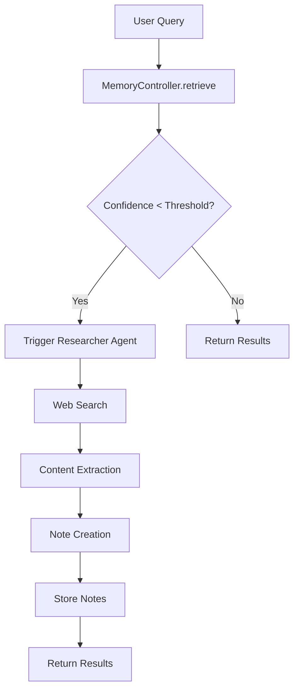
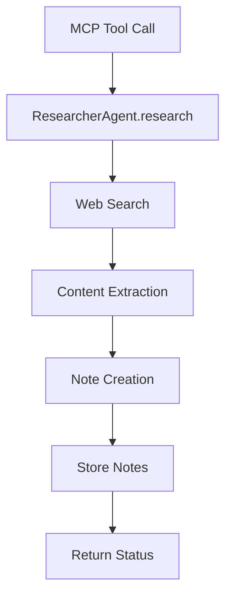
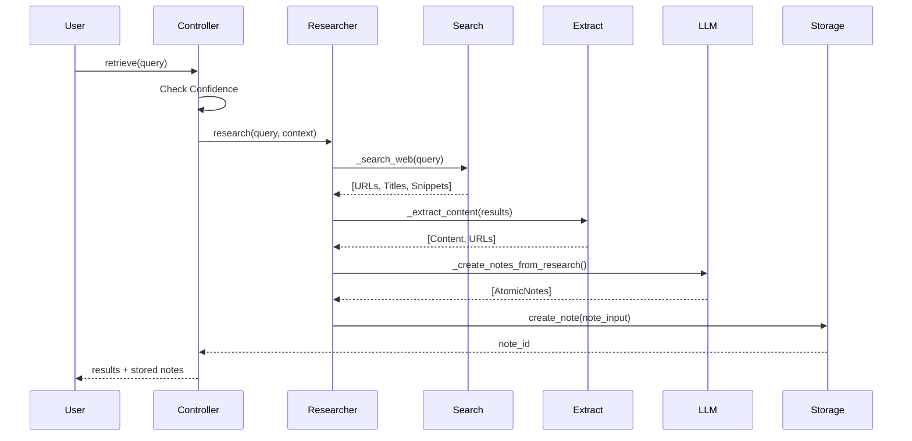

# Researcher Agent - Ausführliche Dokumentation

## 📋 Inhaltsverzeichnis

1. [Übersicht](#übersicht)
2. [Architektur](#architektur)
3. [Code-Einbindung](#code-einbindung)
4. [Funktionen & API](#funktionen--api)
5. [Workflow](#workflow)
6. [Konfiguration](#konfiguration)
7. [Beispiele](#beispiele)
8. [Troubleshooting](#troubleshooting)

---

## Übersicht

Der **Researcher Agent** implementiert das **JIT (Just-in-Time) Research** Konzept aus dem GAM Framework. Er führt automatisch tiefe Web-Recherche durch, wenn die Retrieval-Confidence niedrig ist, und erstellt neue AtomicNotes aus den Ergebnissen.

### Hauptmerkmale

- ✅ **Automatische Triggerung** bei niedriger Retrieval-Confidence
- ✅ **Manuelle Nutzung** via MCP Tool `research_and_store`
- ✅ **Hybrid-Ansatz**: MCP Tools (wenn verfügbar) oder HTTP-Fallbacks
- ✅ **Multi-Source Support**: Google Search API, DuckDuckGo, Jina Reader, Unstructured
- ✅ **PDF-Extraktion**: Automatische Erkennung und Extraktion von PDF-URLs
- ✅ **Metadata-Extraktion**: Automatische Erstellung von Keywords, Tags, Type, Summary

---

## Architektur

### Komponenten

```
┌─────────────────────────────────────────────────────────────┐
│                    Researcher Agent                          │
├─────────────────────────────────────────────────────────────┤
│                                                               │
│  ┌──────────────┐    ┌──────────────┐    ┌──────────────┐  │
│  │ Web Search    │───▶│ Content      │───▶│ Note        │  │
│  │ Module       │    │ Extraction   │    │ Creation    │  │
│  └──────────────┘    └──────────────┘    └──────────────┘  │
│         │                    │                    │          │
│         ▼                    ▼                    ▼          │
│  ┌──────────────────────────────────────────────────────┐  │
│  │         Hybrid Strategy (MCP → HTTP Fallbacks)       │  │
│  └──────────────────────────────────────────────────────┘  │
│                                                               │
└─────────────────────────────────────────────────────────────┘
```

### Dateistruktur

```
src/a_mem/utils/
├── researcher.py          # ResearcherAgent Klasse (Hauptlogik)
└── researcher_tools.py    # HTTP-basierte Tools (Google, DuckDuckGo, Jina, Unstructured)
```

---

## Code-Einbindung

### 1. Automatische Integration in MemoryController

**Datei:** `src/a_mem/core/logic.py`

**Integration-Punkt:** `MemoryController.retrieve()`

```python
async def retrieve(self, query: str, max_results: int = 5) -> List[SearchResult]:
    """
    Retrieves relevant memories with automatic researcher triggering.
    """
    # ... normal retrieval logic ...
    
    # Researcher Agent Integration (Hybrid Approach)
    # Trigger researcher if confidence is low and researcher is enabled
    if settings.RESEARCHER_ENABLED and len(results) > 0:
        top_score = results[0].score if results else 0.0
        if top_score < settings.RESEARCHER_CONFIDENCE_THRESHOLD:
            # Trigger researcher asynchronously (non-blocking)
            # Research happens in background, results are stored automatically
            asyncio.create_task(self._trigger_researcher(query, top_score))
    
    return results
```

**Trigger-Methode:** `_trigger_researcher()`

```python
async def _trigger_researcher(self, query: str, confidence_score: float):
    """
    Triggers the Researcher Agent when retrieval confidence is low.
    Runs asynchronously in background, stores results automatically.
    """
    try:
        from ..utils.researcher import ResearcherAgent
        from ..utils.priority import log_event
        
        log_debug(f"[RESEARCHER] Low confidence ({confidence_score:.2f}) - triggering research for: {query}")
        log_event("RESEARCHER_TRIGGERED", {
            "query": query,
            "confidence_score": confidence_score,
            "threshold": settings.RESEARCHER_CONFIDENCE_THRESHOLD
        })
        
        researcher = ResearcherAgent(llm_service=self.llm)
        research_notes = await researcher.research(
            query=query,
            context=f"Low confidence retrieval (score: {confidence_score:.2f})"
        )
        
        # Store research notes automatically
        notes_stored = 0
        for note in research_notes:
            try:
                # Pass full metadata from ResearcherAgent (avoids duplicate LLM extraction)
                note_input = NoteInput(
                    content=note.content,
                    source="researcher_agent",
                    contextual_summary=note.contextual_summary,
                    keywords=note.keywords,
                    tags=note.tags,
                    type=note.type,
                    metadata=note.metadata
                )
                # Use create_note to store (includes evolution, linking, etc.)
                note_id = await self.create_note(note_input)
                notes_stored += 1
                log_debug(f"[RESEARCHER] Stored note: {note_id[:8]}...")
            except Exception as e:
                log_debug(f"[RESEARCHER] Error storing note: {e}")
                continue
        
        log_event("RESEARCHER_COMPLETED", {
            "query": query,
            "notes_created": len(research_notes),
            "notes_stored": notes_stored
        })
        log_debug(f"[RESEARCHER] Research complete: {notes_stored} notes stored")
        
    except Exception as e:
        log_debug(f"[RESEARCHER] Error in researcher: {e}")
        log_event("RESEARCHER_ERROR", {
            "query": query,
            "error": str(e)
        })
```

### 2. Manuelle Integration via MCP Tool

**Datei:** `src/a_mem/main.py`

**Tool-Definition:**

```python
@server.list_tools()
async def list_tools() -> list[Tool]:
    return [
        # ... other tools ...
        Tool(
            name="research_and_store",
            description="Performs deep web research on a query and stores the findings as atomic notes...",
            inputSchema={
                "type": "object",
                "properties": {
                    "query": {
                        "type": "string",
                        "description": "The research query to search for on the web."
                    },
                    "context": {
                        "type": "string",
                        "description": "Optional context about why this research is needed.",
                        "default": "Manual research request"
                    },
                    "max_sources": {
                        "type": "integer",
                        "description": "Maximum number of sources to extract and create notes from (default: 1).",
                        "default": 1,
                        "minimum": 1,
                        "maximum": 20
                    }
                },
                "required": ["query"]
            }
        )
    ]
```

**Tool-Implementierung:**

```python
elif name == "research_and_store":
    query = arguments.get("query", "")
    context = arguments.get("context", "Manual research request")
    max_sources = arguments.get("max_sources", 1)
    
    # Validate inputs
    if not query:
        return [TextContent(
            type="text",
            text=json.dumps({"error": "query is required"}, indent=2)
        )]
    
    try:
        from .utils.researcher import ResearcherAgent
        from .utils.priority import log_event
        
        log_debug(f"[RESEARCHER] Starting research for: {query} (max_sources: {max_sources})")
        log_event("RESEARCHER_MANUAL_RUN_START", {
            "query": query,
            "context": context,
            "max_sources": max_sources
        })
        
            # Initialize researcher with configurable max_sources
            # Note: MCP tool callback is None in MCP server context (would require MCP client)
            # Researcher will use HTTP-based fallbacks (Google Search API, DuckDuckGo, Jina Reader HTTP)
            researcher = ResearcherAgent(llm_service=controller.llm, max_sources=max_sources, mcp_tool_callback=None)
        
        # Perform research (uses HTTP-based tools directly)
        research_notes = await researcher.research(query=query, context=context)
        
        # Store notes via MemoryController
        notes_stored = 0
        for note in research_notes:
            try:
                note_input = NoteInput(
                    content=note.content,
                    source="researcher_agent",
                    contextual_summary=note.contextual_summary,
                    keywords=note.keywords,
                    tags=note.tags,
                    type=note.type,
                    metadata=note.metadata
                )
                note_id = await controller.create_note(note_input)
                notes_stored += 1
            except Exception as e:
                log_debug(f"[RESEARCHER] Error storing note: {e}")
                continue
        
        return [TextContent(
            type="text",
            text=json.dumps({
                "status": "success",
                "message": f"Research completed: {notes_stored} notes stored",
                "notes_created": len(research_notes),
                "notes_stored": notes_stored
            }, indent=2)
        )]
    except Exception as e:
        return [TextContent(
            type="text",
            text=json.dumps({
                "status": "error",
                "message": f"Research failed: {str(e)}"
            }, indent=2)
        )]
```

---

## Funktionen & API

### ResearcherAgent Klasse

**Datei:** `src/a_mem/utils/researcher.py`

#### `__init__(llm_service, max_sources, mcp_tool_callback)`

Initialisiert den Researcher Agent.

**Parameter:**
- `llm_service` (Optional[LLMService]): LLM Service für Note-Erstellung
- `max_sources` (int): Maximale Anzahl Quellen (default: 1, konfigurierbar via `RESEARCHER_MAX_SOURCES`)
- `mcp_tool_callback` (Optional[Callable]): Optionaler Callback für MCP Tools
  - **Signature**: `async def mcp_tool_callback(tool_name: str, arguments: dict) -> Any`
  - **Verwendung**: Wenn bereitgestellt, werden MCP Tools bevorzugt (felo-search, jina-reader)
  - **Fallback**: Wenn `None` oder MCP Tools fehlschlagen, werden HTTP-basierte Tools verwendet

**Beispiel:**
```python
from a_mem.utils.researcher import ResearcherAgent
from a_mem.utils.llm import LLMService

llm = LLMService()
researcher = ResearcherAgent(
    llm_service=llm,
    max_sources=5,
    mcp_tool_callback=None  # Oder Callback-Funktion
)
```

#### `async research(query, context) -> List[AtomicNote]`

Führt tiefe Web-Recherche durch.

**Parameter:**
- `query` (str): Recherche-Query
- `context` (Optional[str]): Kontext (warum Recherche nötig)

**Rückgabe:**
- `List[AtomicNote]`: Liste von erstellten Notes

**Workflow:**
1. Web-Suche (`_search_web`)
2. Content-Extraktion (`_extract_content`)
3. Note-Erstellung (`_create_notes_from_research`)

#### `research_sync(query, context) -> List[AtomicNote]`

Synchroner Wrapper für `research()`. Nützlich für Tests oder non-async Kontexte.

**Parameter:**
- `query` (str): Recherche-Query
- `context` (Optional[str]): Kontext

**Rückgabe:**
- `List[AtomicNote]`: Liste von erstellten Notes

**Hinweis:** Nutzt `asyncio.run()` intern, sollte nur in non-async Kontexten verwendet werden.

#### `async _search_web(query) -> List[Dict[str, Any]]`

Sucht im Web nach relevanten URLs.

**Strategie (in Prioritätsreihenfolge):**
1. **MCP Tools** (wenn `mcp_tool_callback` verfügbar):
   - `mcp_getweb_felo-search` (technische Recherche, bevorzugt)
   - `mcp_getweb_duckduckgo-search` (allgemeine Suche, Fallback)
2. **HTTP-Fallbacks**:
   - Google Search API (wenn konfiguriert: `GOOGLE_SEARCH_ENABLED=true`)
   - DuckDuckGo HTTP Search (Instant Answer API + HTML Scraping mit BeautifulSoup als Fallback)

**Rückgabe:**
```python
[
    {
        "url": "https://example.com/article",
        "title": "Article Title",
        "snippet": "Article snippet..."
    },
    ...
]
```

#### `async _extract_content(search_results) -> List[Dict[str, Any]]`

Extrahiert Content von URLs.

**Strategie (in Prioritätsreihenfolge):**
1. **MCP Tools** (wenn `mcp_tool_callback` verfügbar):
   - `mcp_getweb_jina-reader` (hohe Qualität, bevorzugt)
2. **HTTP-Fallbacks**:
   - **PDF-URLs**: Unstructured (Library → API Fallback)
   - **Web-Content**: Jina Reader HTTP (lokal Docker → Cloud API Fallback)
   - **Readability**: html2text oder BeautifulSoup (letzter Fallback)

**Rückgabe:**
```python
[
    {
        "url": "https://example.com/article",
        "content": "Extracted content...",
        "title": "Article Title",
        "snippet": "Article snippet..."
    },
    ...
]
```

#### `async _create_notes_from_research(query, extracted_content, context) -> List[AtomicNote]`

Erstellt AtomicNotes aus extrahiertem Content.

**Prozess:**
1. LLM-basierte Zusammenfassung
2. Metadata-Extraktion (keywords, tags, type, summary)
3. AtomicNote-Erstellung

**Rückgabe:**
```python
[
    AtomicNote(
        content="...",
        contextual_summary="...",
        keywords=["...", "..."],
        tags=["...", "..."],
        type="concept",
        metadata={
            "source": "researcher_agent",
            "source_url": "https://...",
            "research_query": "...",
            "context": "..."
        }
    ),
    ...
]
```

### HTTP-basierte Tools

**Datei:** `src/a_mem/utils/researcher_tools.py`

#### `search_google(query, max_results) -> List[Dict]`

Sucht mit Google Custom Search API.

**Parameter:**
- `query` (str): Such-Query
- `max_results` (int): Max. Anzahl Ergebnisse

**Rückgabe:** Liste von Search-Results

#### `search_duckduckgo(query, max_results) -> List[Dict]`

Sucht mit DuckDuckGo (mehrere Strategien).

**Parameter:**
- `query` (str): Such-Query
- `max_results` (int): Max. Anzahl Ergebnisse

**Rückgabe:** Liste von Search-Results

**Strategie (in Prioritätsreihenfolge):**
1. **Instant Answer API** (JSON-Format, keine API-Key nötig)
2. **HTML Scraping** (Regex-Patterns + BeautifulSoup Fallback)

**Hinweis:** DuckDuckGo erfordert keine API-Key und funktioniert als zuverlässiger Fallback.

#### `extract_with_jina_reader(url, max_length, use_local) -> str`

Extrahiert Content mit Jina Reader.

**Parameter:**
- `url` (str): URL zum Extrahieren
- `max_length` (int): Max. Zeichen (default: 10000)
- `use_local` (bool): Versuche lokale Instanz zuerst (default: True)

**Rückgabe:** Extrahierter Text (Markdown-Format)

**Strategie:**
1. **Lokale Docker-Instanz** (`http://localhost:2222/{URL}`) - wenn `JINA_READER_ENABLED=true` und `use_local=True`
2. **Cloud API** (`https://r.jina.ai/{URL}`) - Fallback

**Hinweis:** Lokale Jina Reader gibt Markdown mit Metadata-Header zurück (wird automatisch geparst).

#### `extract_pdf_with_unstructured(url, max_length) -> str`

Extrahiert Content von PDF-URLs mit Unstructured.

**Parameter:**
- `url` (str): PDF-URL (muss `.pdf` enthalten oder enden)
- `max_length` (int): Max. Zeichen (default: 10000)

**Rückgabe:** Extrahierter Text

**Strategie (in Prioritätsreihenfolge):**
1. **Unstructured Library** (`unstructured.partition.pdf`) - wenn `UNSTRUCTURED_USE_LIBRARY=true` und Library installiert
2. **Unstructured API** (`unstructured.partition.api`) - wenn API konfiguriert (`UNSTRUCTURED_API_URL`)
3. **Library Fallback** - wenn API fehlschlägt und Library verfügbar ist

**Hinweis:** PDF wird zuerst in temporäre Datei heruntergeladen, dann extrahiert, danach gelöscht.

#### `extract_with_readability(url) -> str`

Extrahiert Content mit Readability-Algorithmus (letzter Fallback).

**Parameter:**
- `url` (str): URL zum Extrahieren

**Rückgabe:** Extrahierter Text (Markdown oder Plain Text)

**Strategie:**
1. **html2text** (wenn verfügbar) - Konvertiert HTML zu Markdown
2. **BeautifulSoup** (Fallback) - Entfernt Scripts/Styles, extrahiert Text

**Hinweis:** Wird nur verwendet, wenn Jina Reader und Unstructured fehlschlagen.

---

## Workflow

### Automatischer Workflow (bei niedriger Confidence)



### Manueller Workflow (via MCP Tool)



### Detaillierter Research-Workflow



---

## Konfiguration

### Environment Variables

**Datei:** `.env`

```env
# Researcher Agent
RESEARCHER_ENABLED=true
RESEARCHER_CONFIDENCE_THRESHOLD=0.5
RESEARCHER_MAX_SOURCES=5
RESEARCHER_MAX_CONTENT_LENGTH=10000

# Google Search API (optional)
GOOGLE_SEARCH_ENABLED=true
GOOGLE_API_KEY=your_api_key_here
GOOGLE_SEARCH_ENGINE_ID=your_search_engine_id_here

# Jina Reader (optional)
JINA_READER_ENABLED=true
JINA_READER_HOST=localhost
JINA_READER_PORT=2222

# Unstructured (optional, für PDFs)
UNSTRUCTURED_ENABLED=true
UNSTRUCTURED_USE_LIBRARY=true
# ODER
UNSTRUCTURED_API_URL=http://localhost:8000
UNSTRUCTURED_API_KEY=your_api_key_here
```

### Config-Datei

**Datei:** `src/a_mem/config.py`

```python
# Researcher Agent Settings
RESEARCHER_ENABLED = os.getenv("RESEARCHER_ENABLED", "false").lower() == "true"
RESEARCHER_CONFIDENCE_THRESHOLD = float(os.getenv("RESEARCHER_CONFIDENCE_THRESHOLD", "0.5"))
RESEARCHER_MAX_SOURCES = int(os.getenv("RESEARCHER_MAX_SOURCES", "5"))
RESEARCHER_MAX_CONTENT_LENGTH = int(os.getenv("RESEARCHER_MAX_CONTENT_LENGTH", "10000"))

# Google Search API
GOOGLE_SEARCH_ENABLED = os.getenv("GOOGLE_SEARCH_ENABLED", "false").lower() == "true"
GOOGLE_API_KEY = os.getenv("GOOGLE_API_KEY", "")
GOOGLE_SEARCH_ENGINE_ID = os.getenv("GOOGLE_SEARCH_ENGINE_ID", "")

# Jina Reader
JINA_READER_ENABLED = os.getenv("JINA_READER_ENABLED", "false").lower() == "true"
JINA_READER_HOST = os.getenv("JINA_READER_HOST", "localhost")
JINA_READER_PORT = int(os.getenv("JINA_READER_PORT", "2222"))
JINA_READER_URL = f"http://{JINA_READER_HOST}:{JINA_READER_PORT}"

# Unstructured
UNSTRUCTURED_ENABLED = os.getenv("UNSTRUCTURED_ENABLED", "false").lower() == "true"
UNSTRUCTURED_API_URL = os.getenv("UNSTRUCTURED_API_URL", "http://localhost:8000")
UNSTRUCTURED_API_KEY = os.getenv("UNSTRUCTURED_API_KEY", "")
UNSTRUCTURED_USE_LIBRARY = os.getenv("UNSTRUCTURED_USE_LIBRARY", "true").lower() == "true"
```

---

## Beispiele

### Beispiel 1: Automatische Triggerung

```python
# User fragt nach etwas, was nicht im Memory ist
results = await controller.retrieve("knowledge graph systems comparison")

# Wenn Confidence < 0.5:
# → Researcher wird automatisch getriggert
# → Web-Recherche wird durchgeführt
# → Notes werden erstellt und gespeichert
# → Nächste retrieve() findet die neuen Notes
```

### Beispiel 2: Manuelle Nutzung via MCP Tool

```python
# Via MCP Tool
result = await mcp_client.call_tool("research_and_store", {
    "query": "Python async web scraping best practices",
    "context": "Manual research request",
    "max_sources": 3
})

# Ergebnis:
# {
#   "status": "success",
#   "message": "Research completed: 3 notes stored",
#   "notes_created": 3,
#   "notes_stored": 3
# }
```

### Beispiel 3: Direkte Nutzung

```python
from a_mem.utils.researcher import ResearcherAgent
from a_mem.utils.llm import LLMService

llm = LLMService()
researcher = ResearcherAgent(llm_service=llm, max_sources=5)

# Führe Recherche durch
notes = await researcher.research(
    query="LLM memory systems",
    context="Research for comparison"
)

# Notes sind AtomicNote-Objekte, können direkt gespeichert werden
for note in notes:
    print(f"Note: {note.contextual_summary}")
    print(f"Keywords: {note.keywords}")
    print(f"Tags: {note.tags}")
    print(f"Type: {note.type}")
```

---

## Troubleshooting

### Problem: Researcher wird nicht getriggert

**Lösung:**
1. Prüfe `RESEARCHER_ENABLED=true` in `.env`
2. Prüfe `RESEARCHER_CONFIDENCE_THRESHOLD` (default: 0.5)
3. Prüfe ob `retrieve()` Ergebnisse zurückgibt

### Problem: Keine Search-Ergebnisse

**Lösung:**
1. Prüfe Google Search API Konfiguration (wenn verwendet)
2. Prüfe DuckDuckGo HTTP Fallback
3. Prüfe Netzwerk-Verbindung

### Problem: Content-Extraktion schlägt fehl

**Lösung:**
1. Prüfe Jina Reader Konfiguration (lokal oder Cloud)
2. Prüfe Unstructured Installation (für PDFs)
3. Prüfe URL-Erreichbarkeit

### Problem: Notes werden nicht gespeichert

**Lösung:**
1. Prüfe Logs für Fehlermeldungen
2. Prüfe ob `create_note()` erfolgreich ist
3. Prüfe Graph-Speicher-Status

---

## Event Logging

Der Researcher Agent loggt alle wichtigen Events:

- `RESEARCHER_TRIGGERED`: Automatische Triggerung (bei niedriger Confidence)
- `RESEARCHER_MANUAL_RUN_START`: Manuelle Nutzung via MCP Tool gestartet
- `RESEARCHER_MANUAL_RUN`: Manuelle Nutzung abgeschlossen (mit Details zu stored/failed notes)
- `RESEARCHER_COMPLETED`: Recherche abgeschlossen (automatische Triggerung)
- `RESEARCHER_ERROR`: Fehler während Recherche

**Beispiel Event:**
```json
{
  "event": "RESEARCHER_TRIGGERED",
  "timestamp": "2025-11-29T01:11:30.000190",
  "data": {
    "query": "knowledge graph systems",
    "confidence_score": 0.42,
    "threshold": 0.5
  }
}
```

---

## Performance-Optimierungen

### 1. Max Sources Limitierung

Standard: `max_sources=1` (schnell, weniger Notes)
Empfohlen: `max_sources=3-5` (ausgewogen)

### 2. Content Length Limitierung

Standard: `max_content_length=10000` (10KB pro Quelle)
Anpassbar: Je nach LLM-Kontext-Limit

### 3. Asynchrone Ausführung

Researcher läuft asynchron im Hintergrund, blockiert nicht `retrieve()`

### 4. Pre-extracted Metadata

Researcher erstellt Metadata direkt, vermeidet doppelte LLM-Calls

---

## Zukünftige Erweiterungen

- [ ] Caching für wiederholte Queries
- [ ] Rate Limiting für API Calls
- [ ] Parallel Content Extraction
- [ ] Quality Scoring für extrahierte Notes
- [ ] Source-Verifizierung (Fakten-Check)

---

**Letzte Aktualisierung:** 2025-11-29

